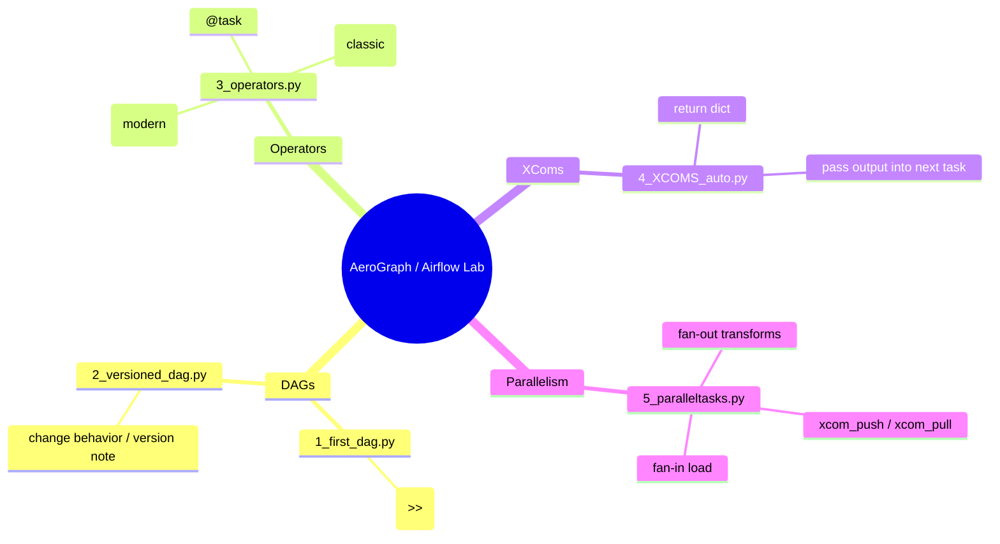
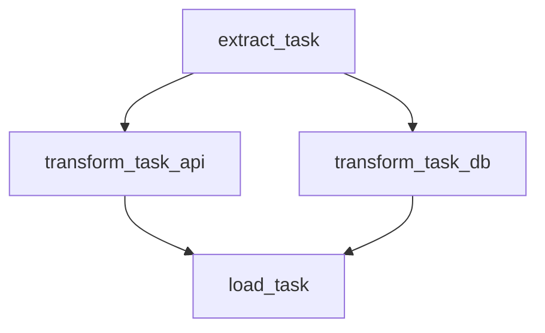

<div align="center">

# ✈️ AeroGraph — Apache Airflow Data Pipeline Lab
### DAG Fundamentals • Operators • XComs • Parallelism (TaskFlow API)

<p align="center">
  <a href="https://github.com/gaurav-singh-tech/AeroGraph-----APache-AIRFLOW-Data-Pipeline"></a>
  <a href="https://airflow.apache.org/"></a>
  <a href="https://www.python.org/"></a>
</p>

<p align="center">
  <a href="#-quickstart"></a>
  <a href="#-dags-in-this-repo"></a>
  <a href="#-xcoms-data-passing"></a>
  <a href="#-parallelism-fanoutfanin"></a>
</p>

**AeroGraph** is a clean, hands‑on learning repo that demonstrates **core Apache Airflow concepts** using small, readable DAG scripts:
- ✅ first DAG + versioned DAG  
- ✅ operators (including BashOperator, modern TaskFlow `@task.bash`)  
- ✅ XComs (auto task return + manual push/pull)  
- ✅ parallel task execution patterns

</div>

---

## ✨ What’s Inside (based on the actual repo files)

| Topic | File / Folder | What it demonstrates |
|---|---|---|
| DAG Basics | `DAGs/1_first_dag.py` | Minimal DAG with 3 Python tasks and dependencies (`>>`) |
| Versioning concept | `DAGs/2_versioned_dag.py` | Same DAG, modified output (“version 2.0”) |
| Operators | `3_operators.py` | TaskFlow + **BashOperator** (old style) + `@task.bash` (modern) |
| XComs (auto) | `4_XCOMS_auto.py` | Passing task outputs as function args (Airflow auto XCom) |
| Parallelism | `5_paralleltasks.py` | Fan‑out to parallel transforms, then fan‑in to load |
| Misc | `main.py` | Simple placeholder “Hello from airflow!” |

---

## 🧠 Mindmap (Repo Map)



---

## 🗺️ Execution Flow (How these DAGs behave)




---

## 📊 Infographic: Airflow Concepts Covered

```text
┌──────────────────────────────────────────────────────────────┐
│                    AeroGraph — Airflow Lab                    │
├──────────────────────────────────────────────────────────────┤
│  ✅ DAG 101                                                     │
│     - define a DAG with @dag                                   │
│     - define tasks with @task.python                           │
│     - set order with >>                                        │
│                                                                │
│  ✅ Operators                                                   │
│     - classic BashOperator                                     │
│     - modern TaskFlow @task.bash                               │
│                                                                │
│  ✅ XComs (cross-communication)                                 │
│     - auto XCom: return values passed as args                  │
│     - manual XCom: xcom_push / xcom_pull                       │
│                                                                │
│  ✅ Parallelism                                                 │
│     - fan-out: extract -> [transform_api, transform_db]        │
│     - fan-in:  [..] -> load                                    │
└──────────────────────────────────────────────────────────────┘
```

---

## 📁 Repository Structure (table)

| Path | Type | Purpose |
|---|---|---|
| `DAGs/` | dir | Basic DAG examples |
| `DAGs/1_first_dag.py` | file | First DAG (3 python tasks) |
| `DAGs/2_versioned_dag.py` | file | Versioned variation |
| `3_operators.py` | file | Operators demo (BashOperator + TaskFlow bash) |
| `4_XCOMS_auto.py` | file | Auto XCom data passing (return values) |
| `5_paralleltasks.py` | file | Parallel tasks + manual XCom push/pull |
| `main.py` | file | Placeholder script |
| `README.md` | file | Documentation |

---

## 🚀 Quickstart

### Option A — Run in a real Airflow environment (recommended)
This repo contains **DAG files**. To run them properly, you need an **Airflow instance** and copy the DAG files into its DAG folder.

**Airflow DAG folder location:**
- Typically: `$AIRFLOW_HOME/dags/`  
- Or configured by your Airflow setup.

**Copy these files:**
- `DAGs/1_first_dag.py`
- `DAGs/2_versioned_dag.py`
- `3_operators.py`
- `4_XCOMS_auto.py`
- `5_paralleltasks.py`

Then open Airflow UI and look for these DAG IDs:
- `first_dag`
- `versioned_dag`
- `bashoperator_dag`
- `XCOMS_dag_auto`
- `parallel_dag`

### Option B — Just read/learn (no Airflow install)
Each file contains clear comments and prints—use this repo as a reference for patterns.

---

## 🧩 DAGs in this Repo

### 1) `first_dag` — Minimal DAG
**File:** `DAGs/1_first_dag.py`  
**What it shows:** task definitions + ordering with `first >> second >> third`

### 2) `versioned_dag` — Same DAG, updated output
**File:** `DAGs/2_versioned_dag.py`  
**What it shows:** a simple way to “version” logic by changing behavior/logs (prints “version 2.0”)

---

## 🧰 Operators (BashOperator + TaskFlow)

**File:** `3_operators.py`

This DAG shows both:
- **Modern TaskFlow Bash**: `@task.bash` returns a bash command string  
- **Classic BashOperator**: an operator object with `bash_command="..."`

---

## 📦 XComs (data passing)

### ✅ Auto XCom (TaskFlow return values)
**File:** `4_XCOMS_auto.py`

Pattern shown:
- `first_task()` returns dict → passed into `second_task(data)` → output into `third_task(data)`
- Dependencies inferred by passing values (no need for `>>` in that style)

### ✅ Manual XCom push/pull
**File:** `5_paralleltasks.py`

Pattern shown:
- `extract_task` pushes a dict to XCom under key `"extracted_data"`
- transform tasks pull it using:
  - `ti.xcom_pull(task_ids="extract_task", key="extracted_data")`
- then each pushes transformed results under their own keys

---

## ⚡ Parallelism (Fan-out / Fan-in)

**File:** `5_paralleltasks.py`

This repo demonstrates a classic orchestration shape:

```text
extract
  ├── transform_api
  └── transform_db
        ↓
       load
```

In code it’s:
```python
extract >> [transform_api, transform_db] >> load
```

---

## 🃏 Flashcards (Airflow quick revision)

**Flashcard 1 — What is a DAG?**  
A Directed Acyclic Graph representing task dependencies and execution order.

**Flashcard 2 — TaskFlow API**  
A Pythonic way to define tasks using decorators like `@dag` and `@task`.

**Flashcard 3 — XCom**  
Airflow’s mechanism to pass small pieces of data between tasks.

**Flashcard 4 — Auto XCom vs manual XCom**  
- Auto: return values are stored and can be passed as args to downstream tasks.  
- Manual: use `ti.xcom_push()` and `ti.xcom_pull()`.

**Flashcard 5 — Fan-out / Fan-in**  
Running multiple tasks in parallel (fan-out) then joining into one downstream task (fan-in).

**Flashcard 6 — BashOperator vs @task.bash**  
- `BashOperator`: classic operator object.  
- `@task.bash`: TaskFlow-style bash task returning command string.

---

## 🧯 Troubleshooting (common Airflow issues)

| Issue | Likely reason | Fix |
|---|---|---|
| DAG not visible in Airflow UI | File not in DAG folder / import errors | Copy to correct DAG folder; check scheduler logs |
| Import error for `airflow.sdk` | Airflow version mismatch | Use a compatible Airflow version or update imports consistently |
| Task fails with XCom pull returns `None` | Wrong `task_ids` or key | Verify task id name and pushed key |
| Parallel tasks not running in parallel | Executor limits | Check your Airflow executor / concurrency settings |

---

## 👤 Author

**Gaurav Singh**  
- LinkedIn: https://www.linkedin.com/in/contact-gauravsingh/  
- GitHub: https://github.com/gaurav-singh-tech  
- Portfolio: https://www.gaurav-singh-portfolio.me/  

---

<div align="center">

### ⭐ Like this Airflow lab? Star the repo!
It helps others find practical Airflow examples quickly.

</div>
